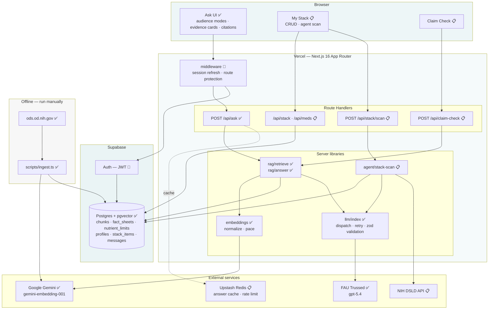
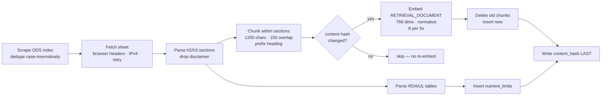
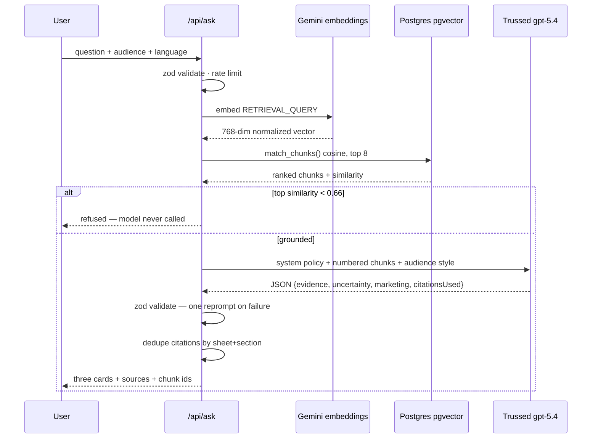
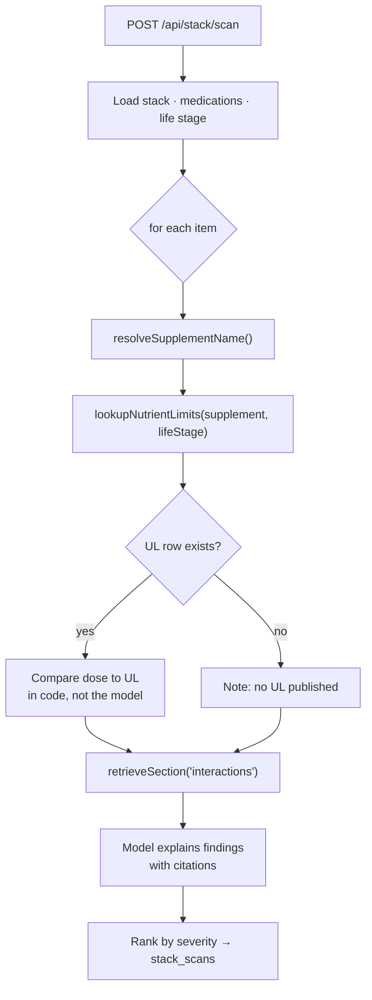
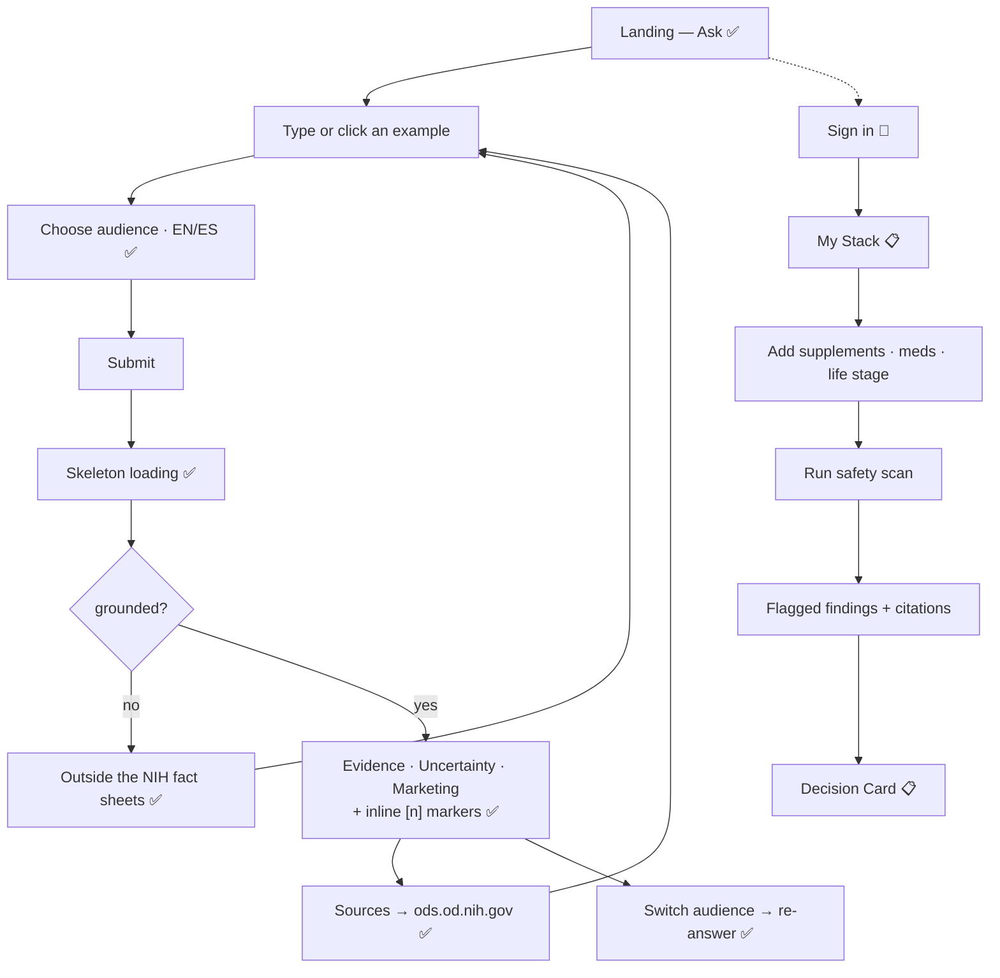
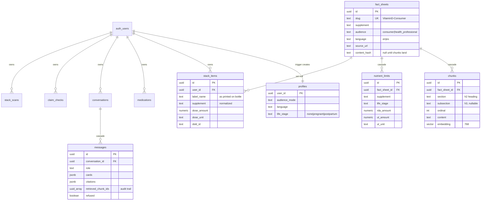
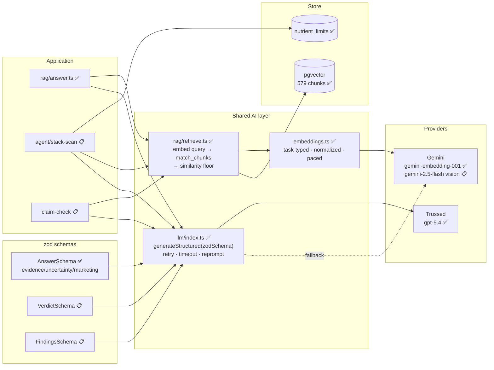
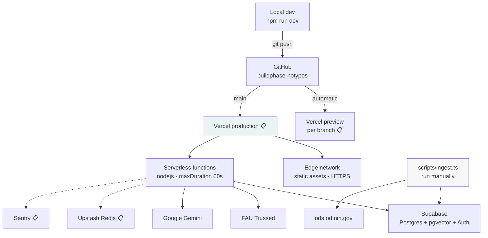

# ClearLabel — Technical Design

**Companion document:** [`plan.md`](plan.md)
**Live schema:** [`supabase/migrations/0001_init.sql`](supabase/migrations/0001_init.sql)

> Diagrams are Mermaid and render natively on GitHub.
> ✅ built and verified · 🔨 in progress · 📋 planned

---

## 1. System Architecture



**Why this shape.** One deployable serves UI and API, so provider keys never reach
the browser. Retrieval is a shared library, not a per-feature implementation — Ask,
Claim Check, and the agent scan all call `retrieve()` and render the same citation
component. Ingestion is deliberately offline: the corpus changes on NIH's schedule,
not per request, so scraping is never on a user's critical path.

---

## 2. Data Flow

### 2.1 Ingestion — offline, idempotent ✅



**Why the hash is written last.** If it were written with the sheet row, a run that
died mid-embed would leave the sheet marked complete with zero chunks — and every
later run would skip it. This was a real bug, found when the preflight reported 5
fact sheets and 0 chunks.

### 2.2 Query — the grounding path ✅



**The load-bearing detail:** on the refusal branch the language model is never
invoked. There is no code path where an unanswerable question reaches a model that
could answer it from its own knowledge.

### 2.3 Agent scan 📋



**Division of labor.** The model decides *which* limits to fetch and how to phrase a
finding. The numeric comparison of a dose against a `nutrient_limits` row happens in
TypeScript. A safety check must not depend on a model doing arithmetic correctly.

---

## 3. User Flow



**Anonymous first.** Ask requires no account — a sign-up wall in front of public
health information would defeat the point. Authentication gates only what is
personal: your stack, your medications, your history.

### Wireframe — the Ask surface ✅

```
┌──────────────────────────────────────────────────────────┐
│  ClearLabel                                              │
│  Plain-language answers about dietary supplements,       │
│  grounded in NIH fact sheets.                            │
│                                                          │
│  (Teen) (•Adult•) (Senior 65+) (Caregiver) │ (English)  │
│                                                          │
│  ┌────────────────────────────────────┐  ┌───────────┐   │
│  │ Ask about a supplement…            │  │    Ask    │   │
│  └────────────────────────────────────┘  └───────────┘   │
│  (How much vitamin D?) (Can too much iron be harmful?)   │
├──────────────────────────────────────────────────────────┤
│ ┌──────────────────────────────────────────────────────┐ │
│ │ WHAT THE EVIDENCE SHOWS                        teal  │ │
│ │ Zinc may shorten a cold if started early.[1][2]      │ │
│ └──────────────────────────────────────────────────────┘ │
│ ┌──────────────────────────────────────────────────────┐ │
│ │ WHAT'S STILL UNCERTAIN                         blue  │ │
│ │ Best dose, form, and timing are unresolved.[1]       │ │
│ └──────────────────────────────────────────────────────┘ │
│ ┌──────────────────────────────────────────────────────┐ │
│ │ WHAT THE MARKETING CLAIMS                     amber  │ │
│ │ Sold as lozenges and syrups; being sold for colds    │ │
│ │ does not mean severity is reduced.[1][8]             │ │
│ └──────────────────────────────────────────────────────┘ │
│ ┌──────────────────────────────────────────────────────┐ │
│ │ SOURCES — NIH OFFICE OF DIETARY SUPPLEMENTS          │ │
│ │ [1] Zinc — What are some effects of zinc on health?  │ │
│ │ [2] Immune Function — Minerals                       │ │
│ └──────────────────────────────────────────────────────┘ │
└──────────────────────────────────────────────────────────┘
```

Three cards rather than a paragraph is a deliberate choice: the evidence /
uncertainty / marketing split is the sponsor's stated requirement, and rendering it
as structure rather than prose makes the distinction impossible to skim past.

---

## 4. Database Schema



### Indexes

| Index | Table | Purpose |
|---|---|---|
| `hnsw (embedding vector_cosine_ops)` | `chunks` | Approximate nearest neighbour — the core retrieval index |
| `btree (fact_sheet_id)` | `chunks` | Cascade deletes and per-sheet re-ingest |
| `btree (supplement, audience, language)` | `fact_sheets` | Corpus filtering |
| `btree (supplement)` | `nutrient_limits` | Agent UL lookups |
| `btree (user_id)` | `stack_items`, `medications` | RLS-filtered reads |
| `btree (conversation_id, created_at)` | `messages` | Ordered transcript |
| `btree (user_id, created_at desc)` | `conversations`, `claim_checks`, `stack_scans` | Recent-first history |

### Row-level security

Corpus tables (`fact_sheets`, `chunks`, `nutrient_limits`) are public-read,
service-role-write. Every user-owned table carries an owner-only policy:

```sql
create policy "own stack" on public.stack_items
  for all using (auth.uid() = user_id) with check (auth.uid() = user_id);
```

`messages` has no `user_id` of its own and inherits ownership through its
conversation:

```sql
create policy "own messages" on public.messages
  for all using (
    exists (select 1 from public.conversations c
            where c.id = messages.conversation_id and c.user_id = auth.uid())
  );
```

A `handle_new_user` trigger creates a `profiles` row on signup, so no code path can
produce an authenticated user without a profile.

### Design notes

**`nutrient_limits` is a separate typed table, not prose.** The RDA and Upper Limit
values are parsed out of the fact-sheet tables into numeric columns. The agent
compares a user's dose to a database row rather than asking a model to recall a
threshold. Dosage limits are exactly the kind of fact where a plausible-but-wrong
number is dangerous.

**`messages.retrieved_chunk_ids` exists for auditability.** It records what
retrieval actually returned for a turn, independent of what the model chose to cite —
so a past answer can be re-checked against its real evidence.

**`content_hash` is nullable by design.** Null means "chunks not yet confirmed."

---

## 5. API Architecture

| Method | Endpoint | Auth | Purpose | Status |
|---|---|---|---|---|
| POST | `/api/ask` | none | Grounded Q&A | ✅ |
| POST | `/api/claim-check` | none | Evidence-strength verdict on a claim | 📋 |
| GET/POST | `/api/stack` | required | List / add stack items | 📋 |
| PATCH/DELETE | `/api/stack/[id]` | required | Update / remove | 📋 |
| GET/POST | `/api/meds` | required | List / add medications | 📋 |
| POST | `/api/stack/scan` | required | Agentic safety scan | 📋 |
| GET | `/api/conversations` | required | History | 📋 |
| POST | `/api/label/scan` | required | DSLD lookup / OCR | 📋 |

### `POST /api/ask` ✅

**Request**

```json
{
  "question": "Does zinc help with colds?",
  "audience": "teen",
  "language": "en"
}
```

`question` 3–500 chars · `audience` ∈ `teen|adult|senior|caregiver` ·
`language` ∈ `en|es`. Validated by zod; unknown fields rejected.

**Response 200 — grounded**

```json
{
  "answer": {
    "evidence": "Zinc may help a cold end sooner if started early.[1][2]",
    "uncertainty": "Best dose, form, and timing are still unclear.[1]",
    "marketing": "Sold as lozenges and syrup; being sold for colds does not mean symptoms are milder.[1][8]",
    "citationsUsed": [1, 2, 8]
  },
  "citations": [
    {
      "index": 1,
      "indices": [1],
      "supplement": "Zinc",
      "section": "What are some effects of zinc on health?",
      "subsection": null,
      "slug": "Zinc-Consumer",
      "url": "https://ods.od.nih.gov/factsheets/Zinc-Consumer/",
      "chunkId": "..."
    }
  ],
  "refused": false,
  "topSimilarity": 0.759,
  "chunkIds": ["...", "..."]
}
```

**Response 200 — refused**

```json
{
  "answer": null,
  "citations": [],
  "refused": true,
  "refusalReason": "The NIH Office of Dietary Supplements fact sheets don't cover this question. I only answer from those sources, so I don't have an answer for you here.",
  "topSimilarity": 0.504,
  "chunkIds": []
}
```

A refusal is **200, not an error**. It is a correct, expected outcome.

**Errors**

| Status | Condition | Body |
|---|---|---|
| 400 | Invalid JSON or failed validation | `{"error": "Ask a question between 3 and 500 characters."}` |
| 429 | > 10 requests/min per IP | `{"error": "Too many questions in a row. Give it a minute."}` |
| 502 | Provider failure after retries | `{"error": "The model is unavailable right now. Please try again."}` |
| 500 | Unexpected | `{"error": "Something went wrong on our side. Try again."}` |

Error bodies carry `LlmError.userMessage`, never provider text or stack traces;
internal detail goes to server logs.

### `POST /api/stack/scan` — planned shape 📋

```json
{
  "findings": [
    {
      "kind": "upper_limit",
      "severity": "high",
      "supplement": "Vitamin D",
      "detail": "Your 250 mcg daily dose exceeds the NIH upper limit of 100 mcg for adults.",
      "userDose": { "amount": 250, "unit": "mcg" },
      "limit": { "amount": 100, "unit": "mcg", "lifeStage": "Adults 19+" },
      "citations": [{ "supplement": "Vitamin D", "section": "Can vitamin D be harmful?", "url": "..." }]
    },
    {
      "kind": "not_checked",
      "supplement": "Ashwagandha",
      "detail": "NIH publishes no upper limit for this supplement, so no dose check was possible."
    }
  ]
}
```

`not_checked` is deliberate. A safety tool that silently omits what it could not
verify reads as "all clear" when it isn't.

---

## 6. AI Component Diagram



### Grounding controls

| Control | Mechanism |
|---|---|
| No ungrounded answers | Below-threshold retrieval returns before any model call |
| Citation enforcement | System prompt requires `[n]` per factual sentence; `citationsUsed` returned and validated |
| No invented content | "Use ONLY the numbered context… never add facts from your own knowledge, even if you are confident they are correct" |
| Empty is valid | Each card may be `""` — the model can say nothing rather than fill the field |
| Schema safety | zod validation → one corrective reprompt → typed error; malformed output never reaches the UI |
| No medical advice | System prompt forbids diagnosis, personal dosing, and start/stop instructions |
| Audit trail | `retrieved_chunk_ids` persisted per message |

### Audience modes

One retrieval, four generation styles. The evidence is identical; only the framing
prompt changes:

| Mode | Reading level | Emphasis |
|---|---|---|
| Teen | Grade 6–8 | Short sentences, concrete, no jargon, no condescension |
| Adult | Grade 8–10 | Plain language, jargon glossed |
| Senior (65+) | Grade 6–8 | One idea per sentence; foregrounds interactions and kidney/liver notes |
| Caregiver | Grade 8–10 | Framed around deciding for someone else and what to raise with a clinician |

Verified in practice: for "is zinc good for colds?" teen mode opens *"Maybe a
little."*; senior mode surfaces the 40 mg upper limit, copper depletion, and
antibiotic/diuretic interactions. Same retrieved chunks.

### Spanish

`language: "es"` retrieves from NIH's own `-DatosEnEspanol` fact sheets rather than
translating English answers. Avoids compounding translation error onto generation
error, and keeps Spanish answers as authoritative as English ones.

---

## 7. Deployment Architecture



### Environments

| Environment | Trigger | Database |
|---|---|---|
| Local | `npm run dev` | Shared Supabase project |
| Preview | Any non-main branch | Same project 📋 (separate project if data diverges) |
| Production | Push to `main` | Same project |

### Environment variables

| Variable | Exposure | Purpose |
|---|---|---|
| `NEXT_PUBLIC_SUPABASE_URL` | browser | Project endpoint |
| `NEXT_PUBLIC_SUPABASE_ANON_KEY` | browser | Publishable key; RLS enforces access |
| `SUPABASE_SERVICE_ROLE_KEY` | **server only** | Corpus writes; bypasses RLS |
| `GEMINI_API_KEY` | **server only** | Embeddings |
| `TRUSSED_API_KEY_OPENAI` | **server only** | Generation |
| `RETRIEVAL_MIN_SIMILARITY` | server | Refusal floor (0.66) |
| `EMBED_BATCH_SIZE`, `EMBED_INTERVAL_MS` | server | Ingest pacing override |

`.env.local` is gitignored and verified so; `.env.example` is committed as
documentation (this required an explicit `!.env.example` negation, because the
default `.env*` pattern hid it too).

### Ingestion is not part of deployment

`scripts/ingest.ts` runs manually against Supabase. It is not triggered by deploys
and Vercel never contacts `ods.od.nih.gov`. The corpus changes on NIH's schedule.
📋 A monthly GitHub Action can automate re-ingest; the content-hash check makes
re-runs nearly free.

### CI/CD 📋

`npm run typecheck` · `npm run lint` · `next build` · `gitleaks` on every push;
Vercel deploys `main` on green.

---

## 8. Technical Decisions

### Next.js 16 App Router — one deployable

A single deployable serves UI and API, so provider keys stay server-side without a
separate backend. Server components and route handlers share the same libraries.
*Rejected:* React SPA + FastAPI — two deploy targets, CORS to configure, no benefit
at this scale.

### TypeScript — chosen for the LLM boundary, not general safety

Initially planned in JavaScript to match the Week 3 project. Reversed, because the
reasoning was wrong: conversion cost was trivial, and the decision should have turned
on what the app actually is. ClearLabel is built on structured model output — evidence
cards, claim verdicts, agent findings. Models return malformed JSON often enough that
runtime validation is required regardless of language. In TypeScript one zod schema
yields the validation *and* the static type. In JavaScript you write the validation by
hand and get no type. Combined with `supabase gen types typescript`, the usual "the
database returns `any`" objection also disappears.

*Accepted cost:* a type error blocks a production build. Mitigations: non-strict mode
initially, `typescript.ignoreBuildErrors` as a documented emergency escape hatch.

### Supabase — backend and vector store in one service

Satisfies the Week 3 backend gate and supplies pgvector, so the vector index sits in
the same database as application data. Retrieval joins `chunks` to `fact_sheets` in
one query to produce a citation with a title, section, and URL. Auth issues JWTs that
RLS reads directly, so authorization is enforced by the database rather than by
remembering to filter in every route.
*Rejected:* Pinecone / Chroma — a second service, a second failure mode, and citations
would require a cross-store join.

### pgvector with HNSW at ~600 chunks

Sub-second retrieval, no extra infrastructure. A dedicated vector database is an
operational cost with no measurable benefit at this size. That calculus changes past
roughly 10⁵ chunks; ClearLabel is two orders of magnitude below it.

### Gemini `gemini-embedding-001` at 768 dimensions

The only available embedding provider — FAU Trussed was probed and serves chat models
only. `text-embedding-004` is retired and 404s. Matryoshka truncation to 768 keeps the
index 4× smaller than the 3072 default with negligible retrieval loss.

Two implementation details that matter more than the model choice:

1. **Asymmetric task types.** `RETRIEVAL_DOCUMENT` for chunks, `RETRIEVAL_QUERY` for
   questions. Using one for both degrades recall in a way that is difficult to detect
   by inspection.
2. **Manual normalization.** Truncated output is not unit-normalized. Without
   normalizing, cosine scores drift and a fixed threshold becomes meaningless.

### Trussed `gpt-5.4` for generation

Provided by FAU at no cost, verified working from Vercel (not campus-only), and strong
at instruction-following for JSON-schema output. Gemini remains the configured fallback
through the same provider abstraction.

### Section-bounded chunking with heading prefixes

Chunks never cross an `<h2>`/`<h3>` boundary, so every chunk maps to a citable
heading — this is what makes "Zinc — What are some effects of zinc on health?"
possible as a citation rather than "Zinc, somewhere." Sections under 1,200 characters
stay whole; longer ones split on sentence boundaries with 150-character overlap so a
dosage statement is never bisected. Each chunk is prefixed with its heading, which
both improves retrieval and keeps an isolated chunk interpretable.
*Rejected:* fixed-size sliding windows — cheap to implement, but they destroy the
heading structure that citations depend on.

### A measured refusal threshold

`RETRIEVAL_MIN_SIMILARITY = 0.66` comes from measurement, not intuition. In-scope
questions score 0.755–0.800; out-of-scope score 0.503–0.630. The initial guess of
0.55 would have answered every off-topic question.

Deliberately set below the midpoint of that gap: "what is the best pre-workout brand
to buy?" scores 0.630, and answering it from the Exercise and Athletic Performance
sheet is better than refusing. The floor is meant to catch questions NIH has no
material on — not to refuse supplement questions phrased commercially.

The threshold is corpus-specific and is re-measured after any chunking or embedding
change.

### Structured output over free-form prose

Answers are a typed object, not a paragraph. The sponsor's requirement — separate
evidence from uncertainty from marketing — is enforced by the schema rather than
requested in a prompt and hoped for. Each field may be empty, so the model can decline
to say anything about marketing rather than inventing a claim to fill the space.

### Deterministic orchestration for the agent

Control flow lives in TypeScript; the model is called at specific decision points.
Numeric dose-vs-limit comparison happens in code. An autonomous loop that could decide
to skip the upper-limit check is unacceptable in a safety feature.

### Anonymous-first authentication

Ask requires no account. Public health information behind a sign-up wall defeats the
purpose. Authentication gates only personal data — stack, medications, history — and
RLS enforces ownership at the database layer.
