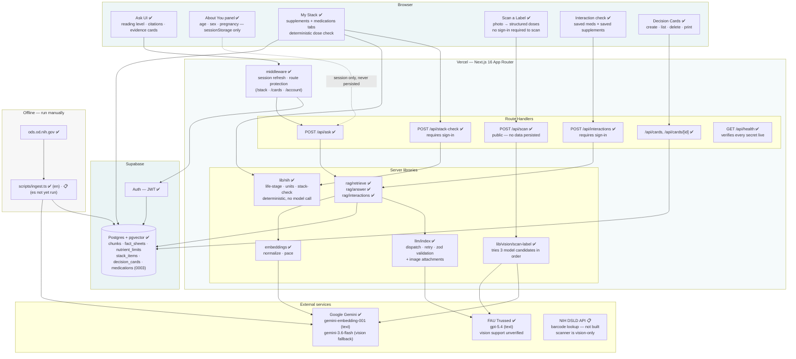
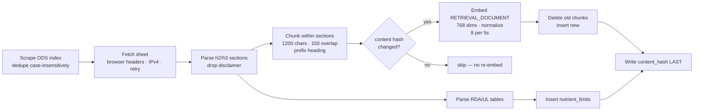
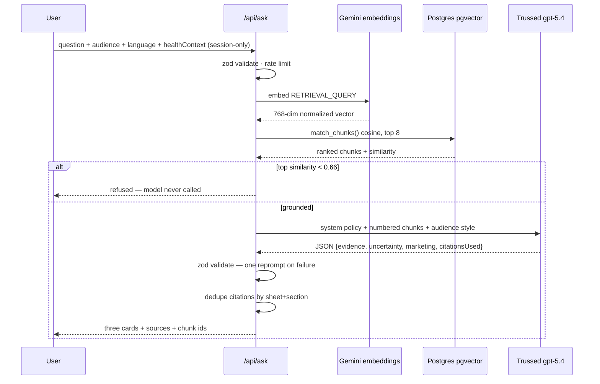
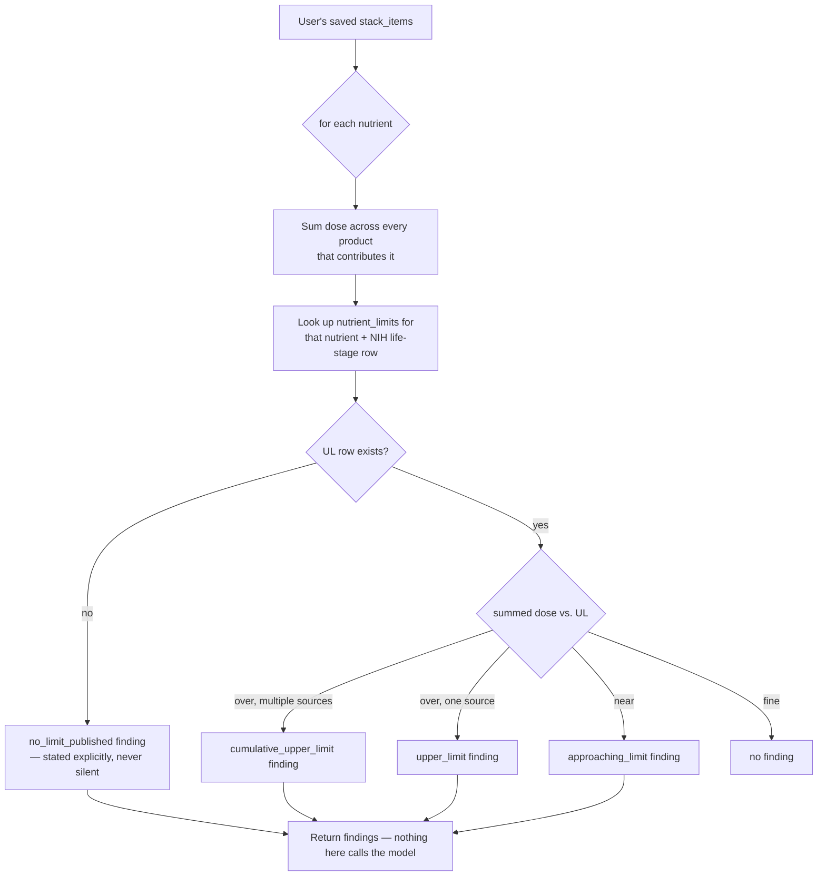
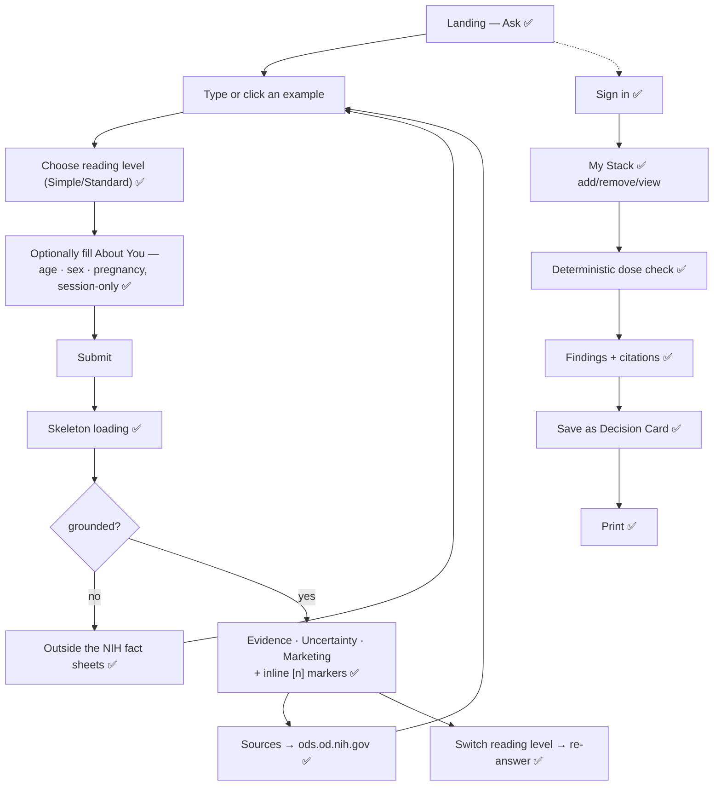
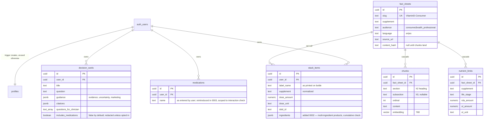
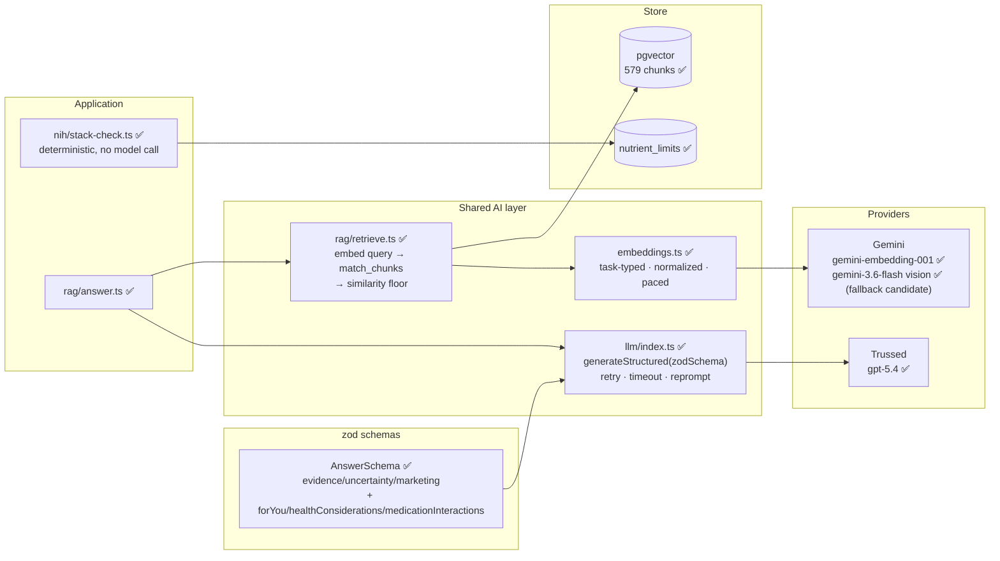
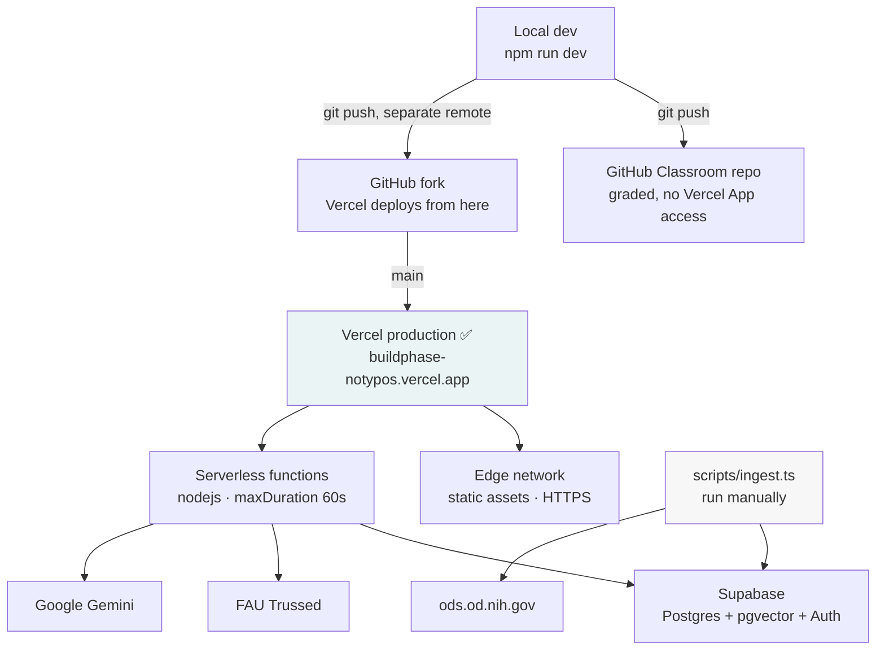

# ClearLabel — Technical Design

**Companion document:** [`plan.md`](plan.md)
**Live schema:** [`supabase/migrations/0001_init.sql`](supabase/migrations/0001_init.sql)

> Diagrams are Mermaid and render natively on GitHub.
> ✅ built and verified · 🔨 in progress · 📋 planned

---

## 1. System Architecture



**Why this shape.** One deployable serves UI and API, so provider keys never reach
the browser. Retrieval is a shared library, not a per-feature implementation — Ask
and the My Stack dose check both resolve through the same NIH fact sheets and
citation format. Ingestion is deliberately offline: the corpus changes on NIH's
schedule, not per request, so scraping is never on a user's critical path.

**What this diagram no longer shows, on purpose.** An earlier version of this
design routed My Stack through an LLM agent with tool-calling
(`lookupNutrientLimits`, `retrieveSection`, `searchDSLD`) and a Claim Check feature
sharing the retrieval layer. Neither was built — see `plan.md` §2.2.2 for why the
agent was deliberately dropped in favor of deterministic code, and §2.2 for why
Claim Check was cut for time. Removing them from this diagram rather than marking
them 📋 forever is intentional: they are not on the roadmap.

## 2. Data Flow

### 2.1 Ingestion — offline, idempotent ✅



**Why the hash is written last.** If it were written with the sheet row, a run that
died mid-embed would leave the sheet marked complete with zero chunks — and every
later run would skip it. This was a real bug, found when the preflight reported 5
fact sheets and 0 chunks.

### 2.2 Query — the grounding path ✅



**The load-bearing detail:** on the refusal branch the language model is never
invoked. There is no code path where an unanswerable question reaches a model that
could answer it from its own knowledge.

### 2.3 My Stack safety check — deterministic, not an agent



**Why this replaced the originally-planned agent.** An earlier version of this
design routed the safety check through an LLM agent with typed tools
(`lookupNutrientLimits`, `retrieveSection`, `resolveSupplementName`, `searchDSLD`)
deciding which checks to run. It was never built, on purpose: **for a safety
feature, an agent that can decide to skip the upper-limit check is a liability.**
`src/lib/nih/stack-check.ts` is a pure function — same input, same findings, every
time, independent of any model call. Two real bugs surfaced by
`scripts/test-life-stage.ts` justify this in retrospect: month ranges padded as
years (an infant's limit reaching a toddler), and age-less "Pregnant teens" rows
matching a 30-year-old. Both would have produced a wrong safety answer silently
if an agent had been making the call instead of a typed comparison with its own
test suite.

## 3. User Flow



**Anonymous first.** Ask requires no account — a sign-up wall in front of public
health information would defeat the point. Scanning a label also requires no
account, for the same reason at a smaller scale: reading a photo touches no
one's data. Authentication gates only what is personal: your stack, your saved
medications, your interaction checks, and your saved Decision Cards. Health
**conditions** are never collected, signed in or not. **Medications** are the
one exception, added Aug 26 and scoped to the interaction check — see "Privacy
design" below.

### Wireframe — the Ask surface ✅

```
┌──────────────────────────────────────────────────────────┐
│  ClearLabel                                              │
│  Plain-language answers about dietary supplements,       │
│  grounded in NIH fact sheets.                            │
│                                                          │
│  (•Simple•) (Standard)                                   │
│                                                          │
│  ┌────────────────────────────────────┐  ┌───────────┐   │
│  │ Ask about a supplement…            │  │    Ask    │   │
│  └────────────────────────────────────┘  └───────────┘   │
│  (How much vitamin D?) (Can too much iron be harmful?)   │
├──────────────────────────────────────────────────────────┤
│ ┌──────────────────────────────────────────────────────┐ │
│ │ WHAT THE EVIDENCE SHOWS                        teal  │ │
│ │ Zinc may shorten a cold if started early.[1][2]      │ │
│ └──────────────────────────────────────────────────────┘ │
│ ┌──────────────────────────────────────────────────────┐ │
│ │ WHAT'S STILL UNCERTAIN                         blue  │ │
│ │ Best dose, form, and timing are unresolved.[1]       │ │
│ └──────────────────────────────────────────────────────┘ │
│ ┌──────────────────────────────────────────────────────┐ │
│ │ WHAT THE MARKETING CLAIMS                     amber  │ │
│ │ Sold as lozenges and syrups; being sold for colds    │ │
│ │ does not mean severity is reduced.[1][8]             │ │
│ └──────────────────────────────────────────────────────┘ │
│ ┌──────────────────────────────────────────────────────┐ │
│ │ SOURCES — NIH OFFICE OF DIETARY SUPPLEMENTS          │ │
│ │ [1] Zinc — What are some effects of zinc on health?  │ │
│ │ [2] Immune Function — Minerals                       │ │
│ └──────────────────────────────────────────────────────┘ │
└──────────────────────────────────────────────────────────┘
```

Three cards rather than a paragraph is a deliberate choice: the evidence /
uncertainty / marketing split is the sponsor's stated requirement, and rendering it
as structure rather than prose makes the distinction impossible to skim past. The
original wireframe showed Teen/Adult/Senior/Caregiver pills where reading level is
now — see "Explicitly cut" in `plan.md`.

---

## 4. Database Schema



**Live but unused.** `0001_init.sql` also created `profiles` (columns
`audience_mode`, `age_band`, `life_stage`), `conversations`, `messages`, and
`claim_checks`, built for the original audience-mode/chat-history/Claim Check
design. None of them are queried or written by any current route — `grep -rn
"\.from('conversations')\|\.from('messages')\|\.from('claim_checks')" src` returns
nothing. `0002_privacy.sql` dropped `life_stage` from `profiles` and dropped
`medications` and `stack_scans` outright (see "Privacy design" below);
`0003_medications.sql` (Aug 26) reintroduced `medications` alone, scoped
narrowly to the new interaction-check feature — `stack_scans` and
`profiles.life_stage` remain dropped. The rest were simply never wired up. They're harmless (RLS-protected, empty) but are a real
cleanup candidate for a future migration rather than something actively used today.

### Indexes

| Index | Table | Purpose |
|---|---|---|
| `hnsw (embedding vector_cosine_ops)` | `chunks` | Approximate nearest neighbour — the core retrieval index |
| `btree (fact_sheet_id)` | `chunks` | Cascade deletes and per-sheet re-ingest |
| `btree (supplement, audience, language)` | `fact_sheets` | Corpus filtering |
| `btree (supplement)` | `nutrient_limits` | Stack-check UL lookups |
| `btree (user_id)` | `stack_items` | RLS-filtered reads |
| `btree (user_id, created_at desc)` | `decision_cards` | Recent-first history |
| `btree (user_id)` | `medications` | RLS-filtered reads |

### Row-level security

Corpus tables (`fact_sheets`, `chunks`, `nutrient_limits`) are public-read,
service-role-write. Every user-owned table carries an owner-only policy:

```sql
create policy "own stack" on public.stack_items
  for all using (auth.uid() = user_id) with check (auth.uid() = user_id);
```

`decision_cards` carries the same pattern. A `handle_new_user` trigger creates a
`profiles` row on signup, so no code path can produce an authenticated user
without a profile — even though nothing currently reads that profile's fields.

### Design notes

**`nutrient_limits` is a separate typed table, not prose.** The RDA and Upper Limit
values are parsed out of the fact-sheet tables into numeric columns.
`stack-check.ts` compares a user's summed dose to a database row rather than
asking a model to recall a threshold. Dosage limits are exactly the kind of fact
where a plausible-but-wrong number is dangerous.

**`content_hash` is nullable by design.** Null means "chunks not yet confirmed."

### Privacy design

| Data | Where it lives |
|---|---|
| Age, sex, pregnancy/breastfeeding | `sessionStorage` only — never written, never logged |
| Health conditions | **Never collected at all** |
| Medications | Persisted (`medications`) — reintroduced `0003_medications.sql`, Aug 26, scoped to the interaction check below |
| Supplements (`stack_items`) | Persisted |
| Saved Decision Cards | Persisted |

Decided deliberately after evaluating HIPAA applicability: HIPAA does not apply
(ClearLabel isn't a covered entity, and the sponsor's own guidelines call full
HIPAA compliance unnecessary here). What does apply — the FTC Health Breach
Notification Rule, and state laws like Washington's My Health My Data Act —
cares about retention and disclosure.

Conditions are never collected because ODS discusses a limited set of them —
most fields would return "no specific guidance," a bad trade for a medical
history. Condition information instead comes from the retrieved fact sheet
itself via `retrieveSafetySections()`.

Medications are the one deliberate exception, added Aug 26 for the interaction
check (§2.2.2 in `plan.md`): `0002_privacy.sql` had dropped this table outright
so the "never collected" claim was verifiable by reading the schema;
`0003_medications.sql` reintroduces it narrowly — RLS-scoped, name-only, used
by nothing except the interaction check. `decision_cards.includes_medications`
still defaults to `false` and redacts medication names from saved card text
unless the user opts in at save time.

The system prompt enforces: *"Based on the information you provided, ODS
documents…"* — never *"based on your medical history, this is safe for you."*

## 5. API Architecture

| Method | Endpoint | Auth | Purpose | Status |
|---|---|---|---|---|
| POST | `/api/ask` | none | Grounded Q&A | ✅ |
| GET/POST | `/api/cards` | required | List / save Decision Cards | ✅ |
| DELETE | `/api/cards/[id]` | required | Remove a Decision Card | ✅ |
| POST | `/api/scan` | **none, deliberately** | Photo → structured doses via vision model; reading a label touches no user data, so no account is required. Rate-limited (6/min/IP) instead. | ✅ |
| POST | `/api/interactions` | required | Supplement × medication interaction check; medication ids are looked up server-side scoped by RLS, never trusted from the client | ✅ |
| POST | `/api/stack-check` | required | Deterministic dose-safety findings over the caller's saved stack | ✅ |
| GET | `/api/health` | none | Verify every configured secret against its real dependency; `?deep=1` adds a live embedding + generation call | ✅ |
| — | `/api/stack` | — | **Does not exist.** Stack CRUD goes directly from the browser to Supabase (`stack_items`, `medications`) via the anon key, authorized by RLS — no custom route layer. | n/a by design |
| — | `/api/claim-check` | — | Never built — feature cut, see `plan.md` "Explicitly cut" | 📋 |
| POST | `/api/scan-product` | none, deliberately | Photo of a bottle's front → identified product → DSLD source-of-truth record; no user data touched | ✅ (see caveat below) |

### `POST /api/ask` ✅

**Request**

```json
{
  "question": "Does zinc help with colds?",
  "audience": "standard",
  "language": "en",
  "healthContext": {
    "ageYears": 34,
    "sex": "female",
    "pregnant": false,
    "breastfeeding": false
  }
}
```

`question` 3–500 chars · `audience` ∈ `simple|standard` (default `standard`) ·
`language` ∈ `en|es` (default `en`; `es` currently refuses everything — corpus not
ingested, see §1) · `healthContext` optional, re-normalized server-side regardless
of what the client sent (`normalizeContext()` — see "Privacy design" below).
Validated by zod; unknown fields rejected.

**Response 200 — grounded**

```json
{
  "answer": {
    "evidence": "Zinc may help a cold end sooner if started early.[1][2]",
    "uncertainty": "Best dose, form, and timing are still unclear.[1]",
    "marketing": "Sold as lozenges and syrup; being sold for colds does not mean symptoms are milder.[1][8]",
    "forYou": "",
    "healthConsiderations": "",
    "medicationInteractions": "",
    "citationsUsed": [1, 2, 8]
  },
  "citations": [
    {
      "index": 1,
      "indices": [1],
      "supplement": "Zinc",
      "section": "What are some effects of zinc on health?",
      "subsection": null,
      "slug": "Zinc-Consumer",
      "url": "https://ods.od.nih.gov/factsheets/Zinc-Consumer/",
      "chunkId": "..."
    }
  ],
  "refused": false,
  "topSimilarity": 0.759,
  "chunkIds": ["...", "..."]
}
```

`forYou`, `healthConsiderations`, and `medicationInteractions` are the three
conditional sections — populated only when `healthContext` was provided and the
retrieved fact sheet actually has relevant content; empty string otherwise, never
omitted, so the client doesn't have to guess which fields might exist.

**Response 200 — refused**

```json
{
  "answer": null,
  "citations": [],
  "refused": true,
  "refusalReason": "The NIH Office of Dietary Supplements fact sheets don't cover this question. I only answer from those sources, so I don't have an answer for you here.",
  "topSimilarity": 0.504,
  "chunkIds": []
}
```

A refusal is **200, not an error**. It is a correct, expected outcome.

**Errors**

| Status | Condition | Body |
|---|---|---|
| 400 | Invalid JSON or failed validation | `{"error": "Ask a question between 3 and 500 characters."}` |
| 429 | > 10 requests/min per IP | `{"error": "Too many questions in a row. Give it a minute."}` |
| 502 | Provider failure after retries | `{"error": "The model is unavailable right now. Please try again."}` |
| 500 | Unexpected | `{"error": "Something went wrong on our side. Try again."}` |

Error bodies carry `LlmError.userMessage`, never provider text or stack traces;
internal detail goes to server logs. Deliberately does not log the request body —
it may carry health context, and "we don't store health data" has to include the
logs.

### My Stack safety check — not an API route

There's no `POST /api/stack/scan`. `computeStackFindings()` in
`src/lib/nih/stack-check.ts` is a plain function, called wherever the My Stack page
needs it, over data already fetched client-side under RLS. Its actual return shape:

```typescript
interface Finding {
  kind: 'upper_limit' | 'cumulative_upper_limit' | 'approaching_limit'
      | 'no_limit_published' | 'not_comparable';
  severity: 'high' | 'medium' | 'info';
  nutrient: string;
  sources: string[];       // which saved products contribute to this finding
  totalMcg?: number;
  limitMcg?: number;
  limitLabel?: string;
  lifeStageRow?: string;
  detail: string;
}
```

`no_limit_published` is deliberate. A safety tool that silently omits what it
could not verify reads as "all clear" when it isn't.

### `POST /api/scan` ✅

**Request:** multipart form data, one `image` file (JPEG/PNG/WEBP/HEIC, ≤ 8 MB).

**Response 200**

```json
{
  "productName": "Nature Made Vitamin D3",
  "items": [
    { "labelName": "Vitamin D3 (Cholecalciferol)", "doseAmount": 2000, "doseUnit": "mcg", "nihTracked": true }
  ],
  "readable": true,
  "note": null
}
```

`readable: false` (empty `items`) only when the photo isn't a legible label at
all. `nihTracked` is computed server-side against `nutrient_limits` so the UI
can flag, before anything is saved, which rows the upper-limit check will
actually be able to use. The image itself is never persisted — used once for
extraction and discarded.

**Errors:** 400 (bad file type/size/form), 429 (> 6/min/IP), 502 (all three
vision candidates failed), 500 (unexpected). Same `LlmError.userMessage`
convention as `/api/ask` — no provider text or stack traces reach the client,
and image bytes are never logged.

### `POST /api/scan-product` ✅ (DSLD half untested against live network calls)

**Request:** multipart form data, one `image` file of the product's front label.

**Response 200 — matched**

```json
{
  "matched": true,
  "dsldId": "214893",
  "productName": "Chia Seeds",
  "brandName": "BareOrganics",
  "items": [{ "labelName": "Fiber", "doseAmount": 5, "doseUnit": "g", "nihTracked": false }]
}
```

**Response 200 — no match:** `{ "matched": false, "reason": "not_recognized" |
"no_dsld_match", "identified"?: {...}, "message": "..." }` — the UI reads
`reason` to decide whether to just retry or switch to the vision-OCR tab.

Two steps chained: `identifyProduct()` (`src/lib/vision/identify-product.ts`)
sends the photo through the same `VISION_MODEL_CANDIDATES` fallback chain the
Supplement Facts scanner uses, but asks only for a brand and product name —
much smaller ask of the model than transcribing a full ingredients table, and
this half is exercised by the same infrastructure already proven live.
`searchDsldByName()` / `getDsldLabel()` (`src/lib/dsld/client.ts`) then hit
NIH's DSLD API, verified live against real responses on Aug 26. **Caveat:**
the DSLD half has never actually been exercised end to end from a running
server — this dev sandbox blocks egress to api.ods.od.nih.gov, so it's
typechecked against a real, verified schema but not live-tested. First real
test happens wherever this runs with normal internet access.

**Replaced approach:** an earlier same-day version of this route (`/api/product-
lookup`) resolved a scanned *barcode* to a product via a UPC database
(UPCitemdb) before searching DSLD, using live camera barcode detection
(native `BarcodeDetector`, falling back to `@zxing/browser`). Built,
typechecked, and reasoned through carefully — then cut later the same day
after testing on the actual demo hardware/browser showed the barcode
detection itself was unreliable in practice. See "Two barcode-detection
engines, not one" in §8 for the fuller postmortem, kept here rather than
deleted since it explains a real decision, not a mistake to hide.

### `POST /api/interactions` ✅

**Request**

```json
{ "supplementNames": ["Vitamin K", "Fish Oil"], "medicationIds": ["<uuid>", "<uuid>"] }
```

**Response 200**

```json
{
  "findings": [
    { "supplement": "Vitamin K", "medication": "Warfarin", "flagged": true,
      "detail": "The fact sheet says vitamin K can reduce warfarin's effectiveness." }
  ],
  "summary": "Based on the information you provided, ODS documents…",
  "uncovered": []
}
```

`medicationIds` are resolved to names server-side via a query scoped by RLS to
the caller — the route never trusts a client-supplied medication name for
what's actually on someone's list. `uncovered` lists any supplement name that
didn't match an NIH fact sheet closely enough to check at all. Rate-limited
tighter than `/api/ask` (5/min/IP) since it's one retrieval pass per supplement
plus a generation call.

---

## 6. AI Component Diagram



For **text** generation (`answer.ts`, `interactions.ts`), nothing automatically
falls back if Trussed fails — the dotted `fallback` edge in an earlier version
of this diagram was aspirational, not built; both always call the Trussed
option, and `google/gemini-3.6-flash` (Google's replacement for the now-retired
`gemini-2.5-flash`) sits registered but unused as a text fallback. Worth
building before the showcase: a single Trussed outage currently fails every
question and every interaction check. **Vision** generation
(`scan-label.ts`) is the one place fallback is real: it tries
`trussed-openai/gpt-5.4` → `trussed-gemini/gemini-2.5-pro` →
`google/gemini-3.6-flash` in order, because Trussed's image support was
unverified going in, not primarily for resilience.

### Grounding controls

| Control | Mechanism |
|---|---|
| No ungrounded answers | Below-threshold retrieval returns before any model call |
| Citation enforcement | System prompt requires `[n]` per factual sentence; `citationsUsed` returned and validated |
| No invented content | "Use ONLY the numbered context… never add facts from your own knowledge, even if you are confident they are correct" |
| Empty is valid | Each card may be `""` — the model can say nothing rather than fill the field |
| Schema safety | zod validation → one corrective reprompt → typed error; malformed output never reaches the UI |
| No medical advice | System prompt forbids diagnosis, personal dosing, and start/stop instructions |
| Audit trail | `chunkIds` returned per response — not persisted server-side, since no conversation history table is actually wired up (see §4) |
| No false reassurance | The interaction check must report "not mentioned" rather than "safe" when a medication isn't named in the retrieved excerpts |

### Reading level

One retrieval, two generation styles (`src/lib/rag/answer.ts` `AUDIENCE_STYLE`).
The evidence is identical; only the framing prompt changes:

| Level | Reading level | Prompt instruction |
|---|---|---|
| Simple | Grade 6–8 | Short sentences, one idea each, everyday words, gloss unfamiliar terms, never condescending |
| Standard | Grade 8–10 | Plain language; explain jargon the first time it appears |

Defaults from age when the user has entered one (`defaultReadingLevel()` in
`health-context.ts`: under 18 or 70+ defaults to Simple), overridable by the level
buttons in the UI. This replaced an earlier four-mode design
(Teen/Adult/Senior/Caregiver) — see `plan.md` "Explicitly cut".

### Spanish

`language: "es"` is designed to retrieve from NIH's own `-DatosEnEspanol` fact
sheets rather than translating English answers, avoiding compounding translation
error onto generation error. **Not functional yet** — the Spanish corpus was never
run through `scripts/ingest.ts --lang es`, so every Spanish question searches an
empty set and refuses. The UI toggle has been hidden (`src/app/page.tsx`) until
this is fixed, rather than ship a control that silently doesn't work. An ingest
attempt on Aug 25 hit a hard Cloudflare 403 on every `-DatosEnEspanol` URL from the
developer's network, unresolved as of this writing — see `plan.md` §3.

---

## 7. Deployment Architecture



**Two remotes, deliberately — plus a third that isn't yet explained.** The
Classroom repo (`FAU-AI-HootCamp-Summer-2026/buildphase-notypos`) is what gets
graded; org admin approval for the Vercel GitHub App on that org wasn't
available, so Vercel deploys instead from a personal fork. Every commit needs
`git push origin main` **and** `git push fork main` — nothing keeps them in
sync automatically, and the fork remote has already gone missing from the local
clone once. There is no Preview-vs-Production branch split in practice; the
fork has one branch and Vercel builds it on every push. A third remote,
`deploy` (`notypos/buildphase-notypos-deploy`), now also exists locally as of
Aug 26 — this document does not know why, or whether Vercel's git integration
currently points at `fork` or at `deploy`. **Confirm in the Vercel dashboard
which repo is actually connected before relying on `git push fork main`
alone**, and push to whichever remote(s) matter before the 11:59 PM submission.
Redis (answer caching, rate limiting) and Sentry (error tracking) were planned
in earlier drafts of this document and never built — removed here rather than
left as permanent 📋 items; see `plan.md` §3.

### Environment variables

| Variable | Exposure | Purpose |
|---|---|---|
| `NEXT_PUBLIC_SUPABASE_URL` | browser | Project endpoint |
| `NEXT_PUBLIC_SUPABASE_ANON_KEY` | browser | Publishable key; RLS enforces access |
| `SUPABASE_SERVICE_ROLE_KEY` | **server only** | Corpus writes; bypasses RLS |
| `GEMINI_API_KEY` | **server only** | Embeddings, and the Google-direct generation option |
| `TRUSSED_BASE_URL` | **server only** | FAU Trussed endpoint; has a working default if unset |
| `TRUSSED_API_KEY_OPENAI` | **server only** | Generation — the only provider actually wired into `/api/ask` |
| `TRUSSED_API_KEY_GEMINI` | **server only** | Registered for the `trussed-gemini` provider option; not exercised by any current route |
| `RETRIEVAL_MIN_SIMILARITY` | server | Refusal floor (0.66) |
| `NEXT_PUBLIC_SITE_URL` | browser | Read only by `/api/health`, which fails the check if this is missing or still says `localhost` |
| `EMBED_BATCH_SIZE`, `EMBED_INTERVAL_MS` | server | Ingest pacing override |

`.env.local` is gitignored and verified so; `.env.example` is committed as
documentation (this required an explicit `!.env.example` negation, because the
default `.env*` pattern hid it too). `NEXT_PUBLIC_SITE_URL` and
`NEXT_PUBLIC_SUPABASE_URL` both trip a Vercel warning suggesting they be marked
"Sensitive" because of the `URL`/`KEY` substring in the name — they should stay
marked **Config**, not Sensitive: Sensitive values aren't readable at build time,
and `NEXT_PUBLIC_` values must be, to get inlined into the client bundle.

### Ingestion is not part of deployment

`scripts/ingest.ts` runs manually against Supabase, from a developer machine — the
Claude cloud/device-bridge tooling used to build this project cannot reach
`ods.od.nih.gov`, `*.supabase.co`, or Google's APIs; egress is allowlisted. Vercel
never contacts `ods.od.nih.gov` either. The corpus changes on NIH's schedule, not
per deploy.

### CI/CD 📋

`npm run typecheck` · `npm run lint` · `next build` on every push — none of this is
currently automated; each has only been run manually. Not built: `gitleaks`,
branch protection, automatic deploy gating on green.

---

## 8. Technical Decisions

### Next.js 16 App Router — one deployable

A single deployable serves UI and API, so provider keys stay server-side without a
separate backend. Server components and route handlers share the same libraries.
*Rejected:* React SPA + FastAPI — two deploy targets, CORS to configure, no benefit
at this scale.

### TypeScript — chosen for the LLM boundary, not general safety

Initially planned in JavaScript to match the Week 3 project. Reversed, because the
reasoning was wrong: conversion cost was trivial, and the decision should have turned
on what the app actually is. ClearLabel is built on structured model output — evidence
cards, claim verdicts, agent findings. Models return malformed JSON often enough that
runtime validation is required regardless of language. In TypeScript one zod schema
yields the validation *and* the static type. In JavaScript you write the validation by
hand and get no type. Combined with `supabase gen types typescript`, the usual "the
database returns `any`" objection also disappears.

*Accepted cost:* a type error blocks a production build. Mitigations: non-strict mode
initially, `typescript.ignoreBuildErrors` as a documented emergency escape hatch.

### Supabase — backend and vector store in one service

Satisfies the Week 3 backend gate and supplies pgvector, so the vector index sits in
the same database as application data. Retrieval joins `chunks` to `fact_sheets` in
one query to produce a citation with a title, section, and URL. Auth issues JWTs that
RLS reads directly, so authorization is enforced by the database rather than by
remembering to filter in every route.
*Rejected:* Pinecone / Chroma — a second service, a second failure mode, and citations
would require a cross-store join.

### pgvector with HNSW at ~600 chunks

Sub-second retrieval, no extra infrastructure. A dedicated vector database is an
operational cost with no measurable benefit at this size. That calculus changes past
roughly 10⁵ chunks; ClearLabel is two orders of magnitude below it.

### Gemini `gemini-embedding-001` at 768 dimensions

The only available embedding provider — FAU Trussed was probed and serves chat models
only. `text-embedding-004` is retired and 404s. Matryoshka truncation to 768 keeps the
index 4× smaller than the 3072 default with negligible retrieval loss.

Two implementation details that matter more than the model choice:

1. **Asymmetric task types.** `RETRIEVAL_DOCUMENT` for chunks, `RETRIEVAL_QUERY` for
   questions. Using one for both degrades recall in a way that is difficult to detect
   by inspection.
2. **Manual normalization.** Truncated output is not unit-normalized. Without
   normalizing, cosine scores drift and a fixed threshold becomes meaningless.

### Trussed `gpt-5.4` for generation

Provided by FAU at no cost, verified working from Vercel (not campus-only), and strong
at instruction-following for JSON-schema output. `google/gemini-3.6-flash`
(the replacement for the now-retired `gemini-2.5-flash`) is registered in the
same provider abstraction and could serve as a text fallback, but nothing
currently switches to it automatically — see §6. That's worth building before
the showcase: right now a single Trussed outage fails every question.

### Section-bounded chunking with heading prefixes

Chunks never cross an `<h2>`/`<h3>` boundary, so every chunk maps to a citable
heading — this is what makes "Zinc — What are some effects of zinc on health?"
possible as a citation rather than "Zinc, somewhere." Sections under 1,200 characters
stay whole; longer ones split on sentence boundaries with 150-character overlap so a
dosage statement is never bisected. Each chunk is prefixed with its heading, which
both improves retrieval and keeps an isolated chunk interpretable.
*Rejected:* fixed-size sliding windows — cheap to implement, but they destroy the
heading structure that citations depend on.

### A measured refusal threshold

`RETRIEVAL_MIN_SIMILARITY = 0.66` comes from measurement, not intuition. In-scope
questions score 0.755–0.800; out-of-scope score 0.503–0.630. The initial guess of
0.55 would have answered every off-topic question.

Deliberately set below the midpoint of that gap: "what is the best pre-workout brand
to buy?" scores 0.630, and answering it from the Exercise and Athletic Performance
sheet is better than refusing. The floor is meant to catch questions NIH has no
material on — not to refuse supplement questions phrased commercially.

The threshold is corpus-specific and is re-measured after any chunking or embedding
change.

### Structured output over free-form prose

Answers are a typed object, not a paragraph. The sponsor's requirement — separate
evidence from uncertainty from marketing — is enforced by the schema rather than
requested in a prompt and hoped for. Each field may be empty, so the model can decline
to say anything about marketing rather than inventing a claim to fill the space.

### Deterministic orchestration over an agent, for the stack-safety check

An earlier draft of this design routed the My Stack dose check through an LLM
agent with tool-calling. It was never built, deliberately: control flow instead
lives in plain TypeScript (`src/lib/nih/stack-check.ts`), the model is never
called for it, and numeric dose-vs-limit comparison happens in code. An
autonomous loop that could decide to skip the upper-limit check is unacceptable
in a safety feature — see §2.3 for the full reasoning and what shipped instead.

### Anonymous-first authentication

Ask requires no account. Public health information behind a sign-up wall defeats the
purpose. Scanning a label requires no account either, for the same reason at
smaller scale. Authentication gates only personal data — the supplements and
medications you've saved, and your Decision Cards — and RLS enforces ownership
at the database layer. Conditions are never collected, signed in or signed out;
medications are the one exception, added Aug 26 and scoped narrowly — see
"Privacy design" in §4.

### Medications reintroduced for one feature, deliberately narrow (Aug 26)

`0002_privacy.sql` dropped `medications` specifically so "we don't collect
medications" was verifiable by reading the schema rather than trusting a
comment. `0003_medications.sql` reverses that, but narrowly: the table holds
only a user-entered name, RLS-scoped, used only by the interaction check. It is
not a return to the original conditions-and-medications design — health
*conditions* are still never collected anywhere in the app, and this reversal
was made explicitly and documented in the migration itself rather than
silently. See `plan.md` §1.3 and §2.2.2, and "Privacy design" in §4 of this
document.

### Two barcode-detection engines, not one

`BarcodeScanForm.tsx` tries the browser's native `BarcodeDetector` first —
free, no bundle download, and covers Chrome on Android plus most desktop
Chrome. It does **not** trust `'BarcodeDetector' in window` alone: Chrome's
own documentation shows `getSupportedFormats()` omitting `upc_a` on at least
macOS even though the constructor exists, which would look like success and
then silently never fire a detection on the exact format printed on most US
supplement bottles. The actual check calls `getSupportedFormats()` and
requires it to include at least one of `upc_a/upc_e/ean_13/ean_8/code_128`
before using the native path at all. `@zxing/browser` (already a dependency
for the label-photo scanner's image handling needs) is the fallback whenever
that check fails — which is unconditional on Safari/iOS, where
`BarcodeDetector` isn't implemented at all. This matters for a live demo
specifically: "works on the developer's laptop" is not the same claim as
"works on whatever device is in front of a judge."

**Update, later the same day: cut.** Both engines were built and reasoned
through carefully, but testing on the actual browser/hardware this project
will be demoed on showed live barcode detection itself was unreliable in
practice — not the browser-support gap this section anticipated, a
different, more basic problem with decoding a real barcode off a real
camera feed in real time. Replaced with `/api/scan-product`: photograph the
product's front label instead, let the already-working vision model (used
elsewhere in this project for the Supplement Facts panel) read the brand and
product name, and search DSLD by that. Same downstream DSLD lookup, no
client-side barcode decoding at all. This section is kept rather than
deleted because the reasoning about format-detection reliability is still
correct — it just turned out not to be the thing that broke.

### A fallback chain for vision, not for text generation

The label scanner tries three model candidates in sequence
(`trussed-openai/gpt-5.4` → `trussed-gemini/gemini-2.5-pro` →
`google/gemini-3.6-flash`) because whether Trussed's proxy actually forwards
image content to a vision-capable backend was unverified when this was built —
the fallback exists to discover that at runtime rather than assume it, not
primarily for uptime. Text generation (`/api/ask`, `/api/interactions`) still
has no automatic fallback; see §6.
