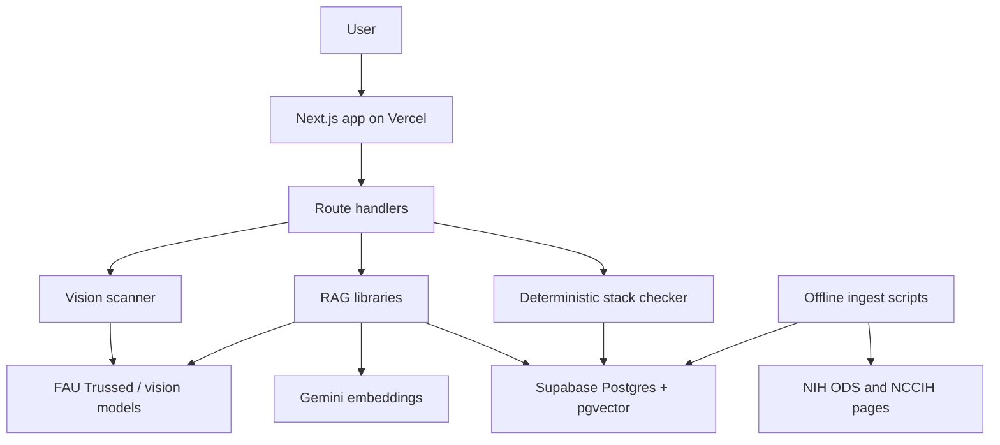

# ClearLabel Architecture

ClearLabel is a single Next.js 16 application deployed on Vercel. The same app
serves the UI and API route handlers, which keeps Supabase, Gemini, and FAU
Trussed keys on the server.

## System Overview

## Main Flows

Ask:

1. User asks a supplement question.
2. The server embeds the query with Gemini.
3. Supabase `pgvector` returns the closest NIH chunks.
4. If similarity is too low, the app refuses without model generation.
5. Otherwise FAU Trussed generates structured evidence, uncertainty, marketing,
   and citation fields from retrieved chunks only.

Scan:

1. User photographs a Supplement Facts panel or product front label.
2. Vision extraction returns structured label data or a DSLD product match.
3. The user can save the result to My Stack after signing in.

My Stack:

1. Saved supplements and medications live in Supabase under RLS.
2. Nutrient totals are computed in TypeScript.
3. NIH upper-limit rows determine cumulative-dose findings.
4. Interaction checks retrieve NIH safety text and constrain model output to
   what the retrieved text says.

## Deployment Shape

Production is hosted at <https://buildphase-notypos.vercel.app>. The GitHub
Classroom repository is the final submission source of truth. Vercel deploys
from the connected production repository and requires the same environment
variables listed in [SETUP.md](SETUP.md).

The full technical design, schema, and tradeoff history live in
[design.md](../design.md).

